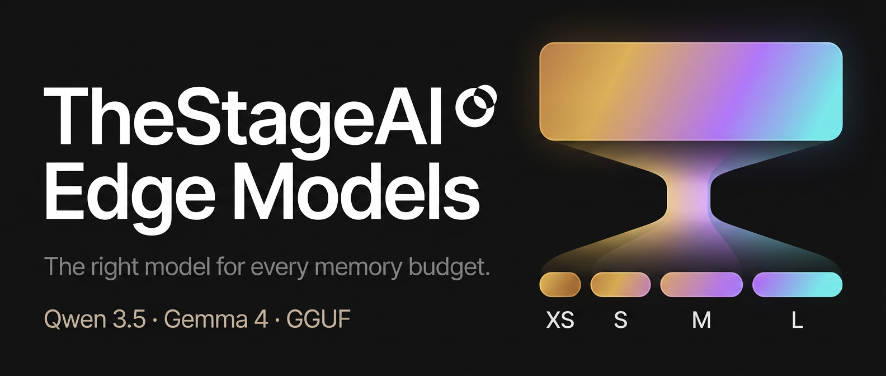

<div align="center">

# edge-lm

**Native compressed Gemma 4 inference on Apple Silicon with MLX.**

Each model includes M and L checkpoints. Vision and audio towers are optional.

[Quick start](#quick-start) · [Native checkpoints](#native-checkpoints) · [Benchmarks](#benchmarks) · [Portable GGUF](#portable-gguf-releases)

</div>

`edge-lm` loads TheStageAI's Gemma 4 checkpoints directly into
[MLX](https://github.com/ml-explore/mlx). The format keeps decoder weights and
per-layer embeddings compact, while vision and audio remain separate files.

## Quick start

`edge-lm` requires an Apple Silicon Mac and Python 3.10 or newer.

```bash
git clone https://github.com/TheStageAI/edge-lm.git
cd edge-lm
python -m venv .venv
source .venv/bin/activate
pip install -e .
```

The default call downloads the 1.44 GB `M` checkpoint from
`TheStageAI/gemma-4-E2B-it`. Vision and audio stay separate until requested.

```python
from edge_lm import load
from mlx_vlm import stream_generate

model, tokenizer = load()

messages = [{"role": "user", "content": "Write a haiku about the moon."}]
prompt = tokenizer.apply_chat_template(
    messages,
    tokenize=False,
    add_generation_prompt=True,
)

for chunk in stream_generate(model, tokenizer, prompt, max_tokens=128):
    print(chunk.text, end="", flush=True)
```

## Native checkpoints

The native release has two operating points per model. `M` is the default;
`L` trades additional storage for higher retained quality.

| Model | M (default) | L (higher quality) | Source model |
| --- | ---: | ---: | --- |
| [Gemma 4 E2B](https://huggingface.co/TheStageAI/gemma-4-E2B-it) | **1.44 GB** | 1.72 GB | [`google/gemma-4-E2B-it`](https://huggingface.co/google/gemma-4-E2B-it) |
| [Gemma 4 E4B](https://huggingface.co/TheStageAI/gemma-4-E4B-it) | **2.72 GB** | 3.28 GB | [`google/gemma-4-E4B-it`](https://huggingface.co/google/gemma-4-E4B-it) |

Use `size="l"` for the larger checkpoint. Vision and audio towers are shared
between operating points and remain optional:

```python
model, tokenizer = load(
    "TheStageAI/gemma-4-E4B-it",
    size="l",
    include_vision=True,
    include_audio=True,
)
```

The multimodal examples pair this tokenizer with the upstream Gemma 4
processor for image and audio preprocessing.

<details>
<summary><strong>QAT-source checkpoints</strong></summary>

These repositories start from Google's QAT-trained weights and use the same
native file format:

- [`TheStageAI/gemma-4-E2B-it-qat`](https://huggingface.co/TheStageAI/gemma-4-E2B-it-qat)
- [`TheStageAI/gemma-4-E4B-it-qat`](https://huggingface.co/TheStageAI/gemma-4-E4B-it-qat)

</details>

## Portable GGUF releases

<p align="center">
  <a href="https://huggingface.co/collections/TheStageAI/edge-lm-6a5f36315458277fa7b9e26a">
    
  </a>
</p>

We also publish Qwen 3.5 and Gemma 4 as GGUF for llama.cpp-compatible runtimes.
Each model has four deployment tiers selected for different memory budgets.

| Family | Models | Tiers |
| --- | --- | --- |
| Qwen 3.5 | 0.8B · 2B · 4B · 9B | XS · S · M · L |
| Gemma 4 | E2B · E4B · 12B | XS · S · M · L |

**[Browse TheStageAI Edge Models on Hugging Face →](https://huggingface.co/collections/TheStageAI/edge-lm-6a5f36315458277fa7b9e26a)**

The GGUF files use llama.cpp-compatible runtimes. The native checkpoints in
this repository use `edge-lm` and MLX.

## How loading works

A native checkpoint is split into decoder weights, compact PLE files, and the
optional multimodal towers. `load()` downloads the selected M or L decoder and
its matching PLE. It fetches the vision and audio files only when the caller
enables them.

The decoder safetensors contain the per-layer precision map used during export.
`edge-lm` reads that map before loading the weights, then replaces Gemma 4's
per-layer embedding module with the compact PLE implementation. The returned
model uses the normal `mlx-vlm` tokenizer, cache, and generation functions.

<p align="center">
  
</p>

The compression write-up explains why Gemma 4's per-layer embeddings need a
separate representation: [*7× size reduction for Gemma 4 Edge models:
Compressing PLE architectures*](https://app.thestage.ai/blog/7x-size-reduction-for-Gemma4-Edge-models?id=14).

## Benchmarks

We measure model quality through a common serving backend. Speed and memory are
measured in the native MLX runtime.

### Quality preservation

For quality comparisons, every checkpoint is materialized into the same
standard Hugging Face layout and served through vLLM. IFEval is prompt-strict /
instruction-strict accuracy.

| Model | Tier | Size | IFEval P / I (%) | MMLU-Pro (%) |
| --- | --- | ---: | ---: | ---: |
| Gemma 4 E2B | BF16 | 10.21 GB | 75.23 / 82.37 | 61.85 |
| Gemma 4 E2B | **M** | **1.44 GB** | 75.23 / 82.61 | 49.85 |
| Gemma 4 E2B | L | 1.72 GB | **76.34 / 83.45** | **54.48** |
| Gemma 4 E4B | BF16 | 15.88 GB | 85.03 / 89.57 | 70.49 |
| Gemma 4 E4B | **M** | **2.72 GB** | 81.33 / 87.05 | 63.54 |
| Gemma 4 E4B | L | 3.28 GB | **84.66 / 89.33** | **67.41** |

### Native MLX performance

The runtime path is measured directly in MLX on an Apple M3 Max with 69 GB of
unified memory. The table uses the `M` checkpoint, 1,024 input tokens, 1,024
generated tokens, 256-token chunked prefill, and the best of five runs.

| Model | Artifact | TTFT | Decode | MLX peak memory | BF16 decode |
| --- | ---: | ---: | ---: | ---: | ---: |
| Gemma 4 E2B | **1.44 GB** | 434 ms | **115.0 tok/s** | **2.1 GB** | 57.2 tok/s |
| Gemma 4 E4B | **2.72 GB** | 832 ms | **73.7 tok/s** | **3.5 GB** | 30.5 tok/s |

Exact protocols, baseline rows, machine-readable results, and reproduction
commands are in [`benchmarks/`](benchmarks/).

## Examples

```bash
# Text generation
python examples/generation_test.py \
  --prompts "What is 2+2?" "Explain gravity in one sentence"

# Add the vision tower
python examples/test_vision.py \
  --image photo.jpg \
  --prompt "Describe this image"

# Add the audio tower
python examples/test_audio.py \
  --audio recording.wav \
  --prompt "Transcribe this speech"

# Interactive local chat
python examples/chat.py
```

> [!CAUTION]
> `examples/chat.py --tools` enables a local demonstration that can execute
> Python and shell commands and read or modify files. Review the tool
> definitions before enabling it.

## Native checkpoint format

Each native model repository contains:

```text
config.json
model_m.safetensors        # decoder weights + M quantization map
model_l.safetensors        # decoder weights + L quantization map
ple_m.safetensors          # compact per-layer embeddings for M
ple_l.safetensors          # compact per-layer embeddings for L
vision_tower.safetensors   # optional, shared
audio_tower.safetensors    # optional, shared
tokenizer.json
tokenizer_config.json
```

`load()` downloads only the selected decoder and PLE files, reads the
quantization map from safetensors metadata, and adds optional towers when they
are requested.

## Citation

If `edge-lm` or the released checkpoints are useful in your work, cite the
repository:

```bibtex
@software{thestage_edge_lm_2026,
  title  = {edge-lm: Native compressed inference on Apple Silicon},
  author = {TheStageAI},
  year   = {2026},
  url    = {https://github.com/TheStageAI/edge-lm}
}
```

## License

The runtime is released under the [Apache License 2.0](LICENSE), © 2026
TheStageAI.

The compressed model weights are derivatives of Gemma 4 and remain subject to
the [Gemma Terms of Use](https://ai.google.dev/gemma/terms).
