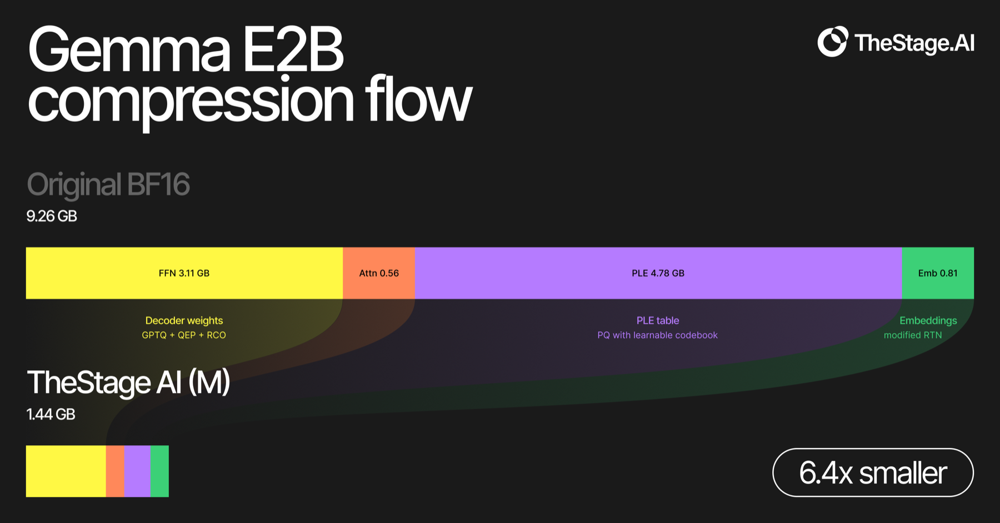

# edge-lm

**Native compressed inference on Apple Silicon with MLX.**

`edge-lm` is TheStageAI's runtime and model format for compressed on-device models. The current native release supports Gemma 4 E2B and E4B, with M/L operating points and optional vision and audio towers.

<p align="center">
  
</p>

[Quick start](#quick-start) · [Examples](#examples) · [Native models](#native-models) · [Benchmarks](#benchmarks) · [Portable GGUF](#portable-gguf)

For portable deployment, see the separate [Qwen3.5](benchmarks/qwen35-GGUF/) and [Gemma 4](benchmarks/gemma4-GGUF/) GGUF releases for llama.cpp-compatible runtimes.

## Quick start

`edge-lm` requires an Apple Silicon Mac and Python 3.10 or newer.

```bash
git clone https://github.com/TheStageAI/edge-lm.git
cd edge-lm
python -m venv .venv
source .venv/bin/activate
python -m pip install -e .
```

The default call selects the 1.44 GB `M` release of `TheStageAI/gemma-4-E2B-it`. It downloads the decoder, compact PLE, and tokenizer files required for text generation; vision and audio remain separate until requested.

```python
from edge_lm import load
from mlx_vlm import stream_generate

model, tokenizer = load()

messages = [{"role": "user", "content": "Write a haiku about the moon."}]
prompt = tokenizer.apply_chat_template(
    messages,
    tokenize=False,
    add_generation_prompt=True,
)

for chunk in stream_generate(model, tokenizer, prompt, max_tokens=128):
    print(chunk.text, end="", flush=True)
```

## Examples

```bash
# Text generation
python examples/generation_test.py \
  --prompts "What is 2+2?" "Explain gravity in one sentence"

# Add the vision tower
python examples/test_vision.py \
  --image photo.jpg \
  --prompt "Describe this image"

# Add the audio tower
python examples/test_audio.py \
  --audio recording.wav \
  --prompt "Transcribe this speech"

# Interactive local chat
python examples/chat.py
```

> [!CAUTION]
> `examples/chat.py --tools` enables a local demonstration that can execute Python and shell commands and read or modify files. Review the tool definitions before enabling it.

## Native models

Current native releases provide two operating points. `M` is the compact default; `L` uses more storage to retain more of the BF16 reference quality.

| Model | M (default) | L (higher quality) | Source model |
| --- | ---: | ---: | --- |
| [Gemma 4 E2B](https://huggingface.co/TheStageAI/gemma-4-E2B-it) | **1.44 GB** | 1.72 GB | [`google/gemma-4-E2B-it`](https://huggingface.co/google/gemma-4-E2B-it) |
| [Gemma 4 E4B](https://huggingface.co/TheStageAI/gemma-4-E4B-it) | **2.72 GB** | 3.28 GB | [`google/gemma-4-E4B-it`](https://huggingface.co/google/gemma-4-E4B-it) |

Use `size="l"` for the larger checkpoint. Optional components are loaded only when requested:

```python
model, tokenizer = load(
    "TheStageAI/gemma-4-E4B-it",
    size="l",
    include_vision=True,
)
```

Use `include_audio=True` for audio. The multimodal examples pair the returned tokenizer with the upstream Gemma 4 processor for preprocessing.

<details>
<summary><strong>Additional QAT-source checkpoints</strong></summary>

These repositories start from Google's QAT-trained weights and use the same native file format:

- [`TheStageAI/gemma-4-E2B-it-qat`](https://huggingface.co/TheStageAI/gemma-4-E2B-it-qat)
- [`TheStageAI/gemma-4-E4B-it-qat`](https://huggingface.co/TheStageAI/gemma-4-E4B-it-qat)

</details>

## Why edge-lm

- **Component-aware loading.** The selected decoder, its matching compact PLE, and optional multimodal towers are stored and downloaded independently.
- **Compact PLE execution.** Gemma 4's per-layer embeddings remain compressed at runtime instead of being materialized as the original dense table.
- **A familiar MLX stack.** The loaded model uses the standard `mlx-vlm` tokenizer, cache, and generation interfaces.

The compression write-up explains why Gemma 4's per-layer embeddings require a separate representation: [*7× size reduction for Gemma 4 Edge models: Compressing PLE architectures*](https://app.thestage.ai/blog/7x-size-reduction-for-Gemma4-Edge-models?id=14).

## Benchmarks

Model quality is measured through a common serving backend. Speed and memory are measured directly in the native MLX runtime.

### Model quality

Every checkpoint is materialized into the same standard Hugging Face layout and served through vLLM. IFEval is prompt-strict / instruction-strict accuracy.

| Model | Tier | Size | IFEval P / I (%) | MMLU-Pro (%) |
| --- | --- | ---: | ---: | ---: |
| Gemma 4 E2B | BF16 | 9.26 GB | 75.23 / 82.37 | 61.85 |
| Gemma 4 E2B | **M** | **1.44 GB** | 75.23 / 82.61 | 49.85 |
| Gemma 4 E2B | L | 1.72 GB | **76.34 / 83.45** | **54.48** |
| Gemma 4 E4B | BF16 | 15.88 GB | 85.03 / 89.57 | 70.49 |
| Gemma 4 E4B | **M** | **2.72 GB** | 81.33 / 87.05 | 63.54 |
| Gemma 4 E4B | L | 3.28 GB | **84.66 / 89.33** | **67.41** |

Small reversals relative to BF16 should be interpreted as evaluation variation, not as evidence that compression improves the source model.

### Native MLX performance

The runtime path was measured on an Apple M3 Max with 69 GB of unified memory. Each run used 1,024 input tokens, 1,024 generated tokens, 256-token chunked prefill, and the best observed result across five repetitions.

| Model | M size | TTFT | Decode | Peak memory | Decode vs BF16 |
| --- | ---: | ---: | ---: | ---: | ---: |
| Gemma 4 E2B | 1.44 GB | 434 ms | **115.0 tok/s** | 2.1 GB | **2.0×** |
| Gemma 4 E4B | 2.72 GB | 832 ms | **73.7 tok/s** | 3.5 GB | **2.4×** |

Exact protocols, baseline rows, machine-readable results, and reproduction commands are in [`benchmarks/`](benchmarks/).

## Portable GGUF

TheStageAI also publishes seven Qwen3.5 and Gemma 4 models for llama.cpp-compatible runtimes. Every model includes XS, S, M, and L deployment tiers, with the recommended tier selected from end-to-end model evaluation.

| Family | Models | Results and artifact metadata |
| --- | --- | --- |
| Qwen3.5 | [0.8B](https://huggingface.co/TheStageAI/Qwen3.5-0.8B-GGUF) · [2B](https://huggingface.co/TheStageAI/Qwen3.5-2B-GGUF) · [4B](https://huggingface.co/TheStageAI/Qwen3.5-4B-GGUF) · [9B](https://huggingface.co/TheStageAI/Qwen3.5-9B-GGUF) | [Qwen3.5 GGUF benchmarks](benchmarks/qwen35-GGUF/) |
| Gemma 4 | [E2B](https://huggingface.co/TheStageAI/gemma-4-E2B-it-GGUF) · [E4B](https://huggingface.co/TheStageAI/gemma-4-E4B-it-GGUF) · [12B](https://huggingface.co/TheStageAI/gemma-4-12B-it-GGUF) | [Gemma 4 GGUF benchmarks](benchmarks/gemma4-GGUF/) |

**[Browse TheStageAI Edge Models on Hugging Face →](https://huggingface.co/collections/TheStageAI/edge-lm-6a5f36315458277fa7b9e26a)**

Use `edge-lm` for the native MLX checkpoints above and llama.cpp-compatible software for the portable GGUF line.

## Under the hood

`load()` resolves the selected operating point, downloads its decoder and PLE, and reads the per-layer precision map stored in the decoder safetensors. It then installs the compact PLE implementation and adds vision or audio only when requested.

The returned model uses the normal `mlx-vlm` tokenizer, cache, and generation functions. The deployment-specific representation stays inside the model files and loader rather than leaking into the generation API.

<details>
<summary><strong>Native checkpoint layout</strong></summary>

```text
config.json
model_m.safetensors        # decoder weights + M quantization map
model_l.safetensors        # decoder weights + L quantization map
ple_m.safetensors          # compact per-layer embeddings for M
ple_l.safetensors          # compact per-layer embeddings for L
vision_tower.safetensors   # optional, shared
audio_tower.safetensors    # optional, shared
tokenizer.json
tokenizer_config.json
```

</details>

## Citation

If `edge-lm` or its native checkpoints are useful in your work, cite the repository. Each portable GGUF repository also includes a release-specific citation.

```bibtex
@software{thestage_edge_lm_2026,
  title  = {edge-lm: Native compressed inference on Apple Silicon},
  author = {TheStageAI},
  year   = {2026},
  url    = {https://github.com/TheStageAI/edge-lm}
}
```

## License

The runtime is released under the [Apache License 2.0](LICENSE), © 2026 TheStageAI.

The linked Gemma 4 and Qwen3.5 releases are derived from Apache-2.0 upstream checkpoints. Each Hugging Face card records the exact base model and revision.
