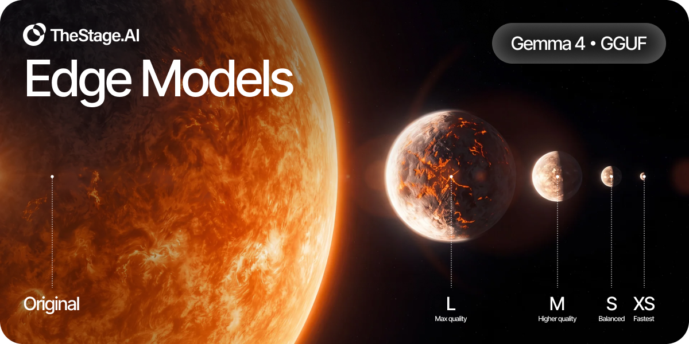

# Gemma 4 GGUF benchmarks

[← Benchmark index](../)

This directory is the public benchmark snapshot for the three Gemma 4 GGUF
repositories. Each repository contains XS, S, M, and L checkpoints for
llama.cpp-compatible runtimes.

## Recommended checkpoints

| Model | Start with | Size | IFEval P / I (%) | MMLU-Pro (%) |
| --- | ---: | ---: | ---: | ---: |
| [Gemma 4 E2B IT](https://huggingface.co/TheStageAI/gemma-4-E2B-it-GGUF) | **S** | 2.40 GB | 77.26 / 83.93 | 60.70 |
| [Gemma 4 E4B IT](https://huggingface.co/TheStageAI/gemma-4-E4B-it-GGUF) | **S** | 3.76 GB | 85.21 / 89.81 | 69.48 |
| [Gemma 4 12B IT](https://huggingface.co/TheStageAI/gemma-4-12B-it-GGUF) | **M** | 6.72 GB | 88.35 / 91.61 | 73.34 |

Each recommendation follows the best measured size and quality trade-off for
that model.

## Evaluation modes

- **IFEval:** 541 prompts with the native chat template, thinking disabled,
  temperature 0, and a 1,280-token generation limit.
- **MMLU-Pro:** 12,032 questions with the native chat template, thinking
  enabled, temperature 1, top-p 0.95, and a 32,768-token generation limit.

All 15 BF16/XS/S/M/L rows have complete IFEval and MMLU-Pro results. XS
prioritizes minimum file size. S or M is the recommended starting point when
long-form reasoning matters.

Downstream quality runs use release-aligned Hugging Face mirrors served through
vLLM. The shipping GGUFs pass separate export and llama.cpp load gates. These
tables compare model behavior; they are not llama.cpp performance benchmarks.

## Complete quality results

Scores are percentages. P / I means prompt-strict / instruction-strict IFEval.

### Gemma 4 E2B IT

| Variant | IFEval P / I | MMLU-Pro |
| --- | ---: | ---: |
| BF16 | 76.89 / 83.81 | 61.51 |
| XS | 70.24 / 79.62 | 48.09 |
| **S** | **77.26 / 83.93** | **60.70** |
| M | 75.97 / 83.45 | 59.80 |
| L | 76.34 / 83.45 | 60.95 |

### Gemma 4 E4B IT

| Variant | IFEval P / I | MMLU-Pro |
| --- | ---: | ---: |
| BF16 | 84.84 / 89.33 | 69.91 |
| XS | 80.96 / 86.81 | 65.30 |
| **S** | **85.21 / 89.81** | **69.48** |
| M | 85.40 / 89.81 | 69.55 |
| L | 84.84 / 89.09 | 70.01 |

### Gemma 4 12B IT

| Variant | IFEval P / I | MMLU-Pro |
| --- | ---: | ---: |
| BF16 | 88.54 / 91.85 | 73.93 |
| XS | 79.48 / 85.01 | 44.91 |
| S | 84.84 / 89.45 | 55.20 |
| **M** | **88.35 / 91.61** | **73.34** |
| L | 88.72 / 91.97 | 74.11 |

## Machine-readable results

- [`quality.csv`](quality.csv) contains all 15 BF16/XS/S/M/L evaluation rows.
- [`artifacts.csv`](artifacts.csv) contains the 12 shipping GGUFs with exact
  filenames, byte sizes, whole-file BPW, file types, held-out KL, revisions,
  evaluation IDs, and SHA-256 digests.

Scores in `quality.csv` are stored as fractions.

## Snapshot provenance

The tables were derived from the verified 28-checkpoint release ledger and the
complete release benchmark aggregate. Source snapshot hashes:

- benchmark matrix: `3ca0546eff55ee761e54dcecc9eec366c41f6d62e96b00dc7c22cad067dd4233`
- checkpoint manifest: `c03954d8d3751a7b1402945b1fc1ed1aa38683a8220da87e0cc312449daf5dad`
- artifact metadata: `ced7b42d19c2eed3b06ea0b43e54b2e3a3303183ad11ebd69e611f763b342495`
